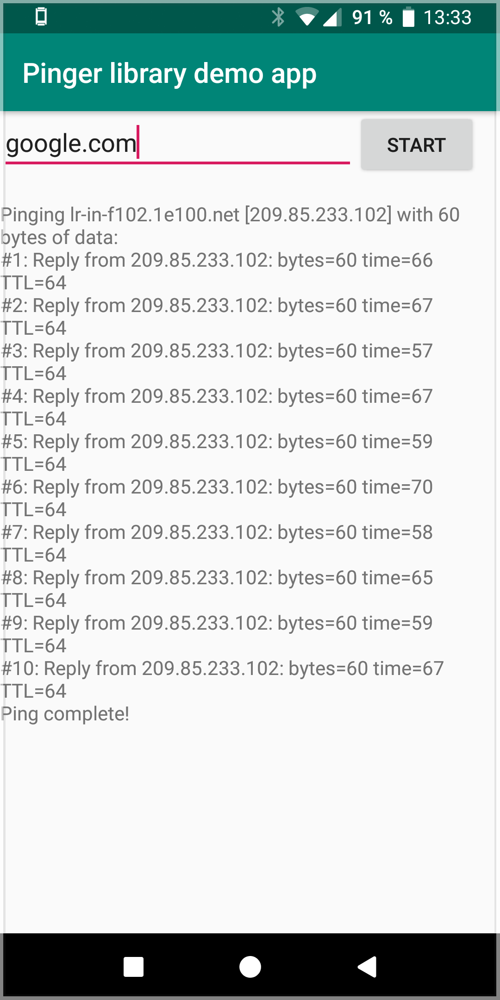

## Setup
Main build.gradle:
```
allprojects {
  repositories {
    ...
    maven { url 'https://jitpack.io' }
	...
  }
}
````

Target module build.gradle
```
dependencies {
  ...
  implementation 'me.impa:Pinger:0.1'
  ...
}
```

## Usage

Kotlin:
```kotlin
val pinger = Pinger()
pinger.setOnPingListener(object : Pinger.OnPingListener {
	override fun OnStart(pingInfo: PingInfo) {
		Log.i("PING", "Pinging ${pingInfo.ReverseDns} [${pingInfo.RemoteIp}]")
	}

	override fun OnStop(pingInfo: PingInfo) {
		Log.i("PING", "Ping complete")
	}

	override fun OnException(pingInfo: PingInfo, e: Exception, isFatal: Boolean) {
	}

	override fun OnTimeout(pingInfo: PingInfo, sequence: Int) {
		Log.i("PING", "#$sequence: Timeout!")
		if (sequence>=10)
			pingInfo.Pinger.Stop(pingInfo.PingId)
	}

	override fun OnReplyReceived(
		pingInfo: PingInfo,
		sequence: Int,
		timeMs: Int
	) {
		Log.i("PING", "#$sequence: Reply from ${pingInfo.RemoteIp}: bytes=${pingInfo.Size} time=$timeMs TTL=${pingInfo.Ttl}")
		if (sequence>=10)
			pingInfo.Pinger.Stop(pingInfo.PingId)
	}

	override fun OnSendError(pingInfo: PingInfo, sequence: Int) {
	}
})

pinger.Ping("google.com")
```

Java:
```java
Pinger pinger = new Pinger();
pinger.setOnPingListener(new Pinger.OnPingListener() {

	@Override
	public void OnStart(@NonNull PingInfo pingInfo) {
		Log.i("PING", String.format("Pinging %s [%s]", pingInfo.ReverseDns, pingInfo.RemoteIp));
	}

	@Override
	public void OnStop(@NonNull PingInfo pingInfo) {
		Log.i("PING", "Ping complete");
	}

	@Override
	public void OnSendError(@NonNull PingInfo pingInfo, int sequence) {

	}

	@Override
	public void OnReplyReceived(@NonNull PingInfo pingInfo, int sequence, int timeMs) {
		Log.i("PING", String.format("#%d: Reply from %s: bytes=%d time=%d TTL=%d", sequence, pingInfo.RemoteIp, pingInfo.Size, timeMs, pingInfo.Ttl));
		if (sequence>=10)
			pingInfo.Pinger.Stop(pingInfo.PingId);
	}

	@Override
	public void OnTimeout(@NonNull PingInfo pingInfo, int sequence) {
		Log.i("PING", String.format("#%d: Timeout!", sequence));
		if (sequence>=10)
			pingInfo.Pinger.Stop(pingInfo.PingId);
	}

	@Override
	public void OnException(@NonNull PingInfo pingInfo, @NonNull Exception e, boolean isFatal) {

	}
});
pinger.Ping("google.com");
```


